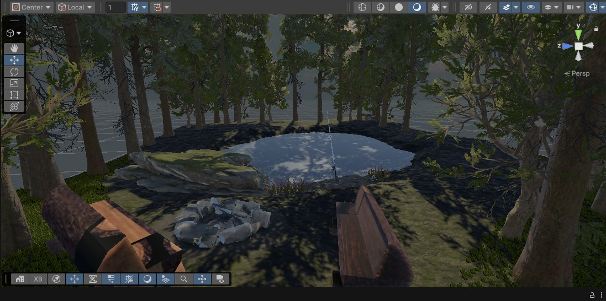

# CampVerse

Ambiente virtual imersivo de acampamento criado em Unity para exploração em VR, com foco em relaxamento, presença e interações simples no cenário.



## Sobre o projeto

O **CampVerse** foi desenvolvido como um espaço natural voltado para lazer no metaverso. A proposta é colocar a pessoa usuária em um acampamento com lago, árvores, pedras, bancos e fogueira, criando uma experiência tranquila de contemplação e interação.

Na versão atual, o projeto concentra seus esforços em:

- composição de um cenário natural imersivo;
- configuração do ambiente para XR com Unity e Meta XR SDK;
- interações básicas com objetos do cenário;
- experimentação de fluxo de build para dispositivos Meta Quest.

## Funcionalidades atuais

- Cena principal de exploração em VR: `Assets/Scenes/CampVerseScene.unity`
- Interação com vara de pesca usando evento de seleção
- Animação da vara de pesca ao interagir
- Alternância da fogueira entre ligada e desligada
- Estrutura XR configurada com `OpenXR` e `Meta XR SDK`
- Configuração Android/VR preparada para a família Meta Quest

## Stack e tecnologias

- `Unity 6` (`6000.3.13f1`)
- `C#`
- `OpenXR`
- `Meta XR SDK All` (`com.meta.xr.sdk.all` `201.0.0`)
- `Unity XR Meta OpenXR` (`2.5.0`)
- `Unity Input System`
- `URP` e pacotes gráficos da Unity presentes no projeto

## Estrutura relevante

```text
Assets/
|- Scenes/
|  |- CampVerseScene.unity
|- Scripts/
|  |- CampfireToggle.cs
|  |- FishingRodInteraction.cs
|- images/
|  |- Image1.jpeg
|- XR/
|  |- Settings/
|  |- Loaders/
Packages/
|- manifest.json
ProjectSettings/
|- ProjectVersion.txt
|- EditorBuildSettings.asset
```

## Interações implementadas

### Vara de pesca

O script [`FishingRodInteraction.cs`](Assets/Scripts/FishingRodInteraction.cs) dispara a animação `"Take 001"` quando o objeto é selecionado por uma interação configurada na cena.

### Fogueira

O script [`CampfireToggle.cs`](Assets/Scripts/CampfireToggle.cs) alterna o objeto `fireEffect` entre ativo e inativo, permitindo ligar e desligar a fogueira.

## Requisitos para abrir o projeto

- `Unity 6.0` compatível com a versão `6000.3.13f1`
- Suporte a `Android Build Support`
- Módulos de desenvolvimento VR/XR instalados no Unity
- Ambiente configurado para `OpenXR`

## Como executar no Unity

1. Abra o Unity Hub.
2. Adicione este repositório como projeto.
3. Abra o projeto com a versão `6000.3.13f1`.
4. Aguarde a importação dos pacotes.
5. Abra a cena [`CampVerseScene.unity`](Assets/Scenes/CampVerseScene.unity).
6. Teste no Editor ou gere uma build Android para headset Meta Quest.

## Build alvo

O projeto está configurado com foco em `Android` e possui manifesto com categoria VR para dispositivos:

- `Quest`
- `Quest 2`
- `Quest Pro`
- `Quest 3`
- `Quest 3S`

## Aprendizados do projeto

Durante o desenvolvimento, os principais aprendizados foram:

- montagem de cenários imersivos em Unity;
- uso de XR para navegação e interação em VR;
- integração inicial com o ecossistema Meta;
- implementação de interações simples em `C#`.

## Desafios encontrados

- modelagem e composição do terreno;
- ajustes e testes com `XR Device Simulator`;
- correção e reestruturação de scripts durante o desenvolvimento.

## Melhorias futuras

- adicionar sons ambientes da natureza;
- inserir montanhas ou elementos de fundo para ampliar a sensação de escala;
- incluir peixes e novos eventos no lago;
- expandir as interações do acampamento;
- revisar identidade do app, nome do produto e `applicationId` antes de uma publicação.

## Observações importantes

- O nome exibido em `Player Settings` ainda está como `advanced-project-vr-evilis-gomes-irede-metaverse`.
- O `applicationIdentifier` Android ainda usa o identificador padrão do template Unity.
- Há muitos assets e pastas geradas pelo editor no repositório; para distribuição, vale revisar o versionamento de diretórios como `Library/` e `Logs/`.

## Autoria

**Evilis Glenio Teixeira Gomes**  
Trilha `1`

## Repositório

<https://github.com/EvilisGlenio/advanced-project-vr-evilis-gomes-irede-metaverse>
